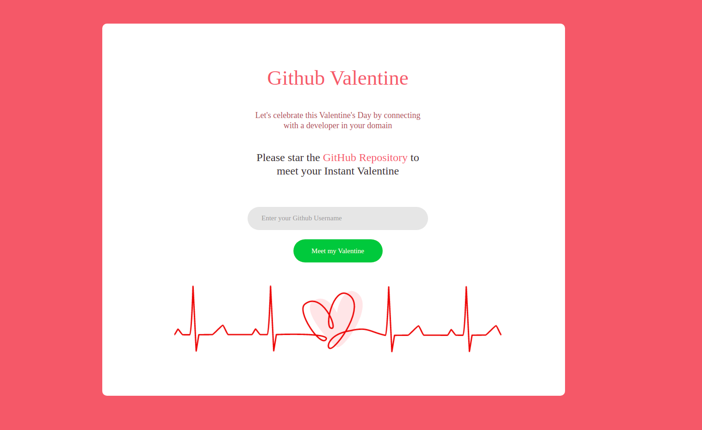

<h1 align="center">
  <br>
  GitHub Valentine❤️
  <br>
</h1>
<div align="center">
  
[](https://github.com/hashirpm/github-valentine/graphs/contributors)  [](https://github.com/hashirpm/github-valentine/wiki) [](https://github.com/hashirpm/github-valentine/tags/) [](http://makeapullrequest.com)

</div>
</div>

<h4 align="center">
:anchor:  Let's celebrate this Valentine's Day by connecting with a developer in your domain.
</h4>

<div>
<br>



	
See the demo of [GitHub Valentine](https://github-valentine.up.railway.app/)


## How to use❓

1. Star the repo ⭐
2. Head over to [GitHub Valentine](http://valentine.metainc.in/) 🌐
3. Enter your GitHub username 👨🏻‍💻
4. Boom! Now you can connect with your GitHub valentine 🤜🏻🤛🏻

## What technologies used❓
1. Github API
2. NodeJS
3. ExpressJS
4. Handlebars
	
## 📥 Installing and Executing locally


1. Fork this repository, by clicking the `Fork` button at the top-right on this page.
	
2. Clone the forked repository from your GitHub account.
```
git clone https://github.com/[replace-with-your-github-username]/github-valentine.git
```

3. Go to the cloned directory (e.g. `cd github-valentine`).

4. Run ```npm install``` to install all the dependencies


5. Inner the folder of the cloned project, start the application : 
```
npm run start
```
6. After that, the command will start a local server instance. Open (http://localhost:5000/) in your browser. The **GitHub Valentine** will be displayed.

## 🖋 Contribute
	
> Please, feel free to make **pull request** if you have any improvements or any sort of changes.Your contribution is always welcome!

**Don't know How to Contribute, head over to the [docs](https://github.com/hashirpm/github-valentine/blob/main/files/README.md)**
	
	


## Contributors
	
SR No | Author  
--- | ---
1 | [Muhammed Hashir](https://github.com/hashirpm)
2 | [Abdul Adhil PK](https://github.com/adhilcodes)

<p align="center">
	Made with :heart: by xDev
</p>
	
